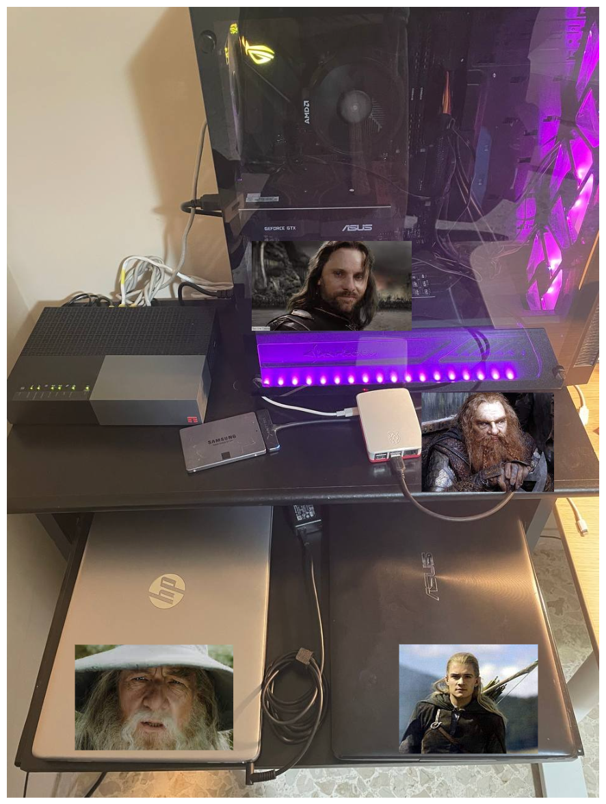

# homelab2.0

## Physical Server

|  Name	|  IP	|  RAM	|  vCPU	| Disk Size | CPU Model	|  OS 	|
|---	|---	|---	|---	|---	|---	|---	|
| Aragorn 	|  192.168.0.20	|  16 GB | 12 vCPU 	|  250 GB	|  AMD Ryzen 5 2600X	|  Proxmox 7.2	|
| Legolas	|  192.168.0.30	|  4 GB	 |  4 vCPU  |  250 GB	|  i5-3337U 	        |  Ubuntu 22.04	|
| Gandalf	|  192.168.0.10	|  8 GB	 |  8 vCPU	|  250 GB   |  i5 1135G7	        |  Proxmox 7.2  |
| Gimli     |  192.168.0.2  |  4 GB  |  4 vCOU  |  250 GB   |  ARM Cortex-A72       |  Debian 11    | 

 

## My complete setup

## Virtual Machines

### Coming soon :)

